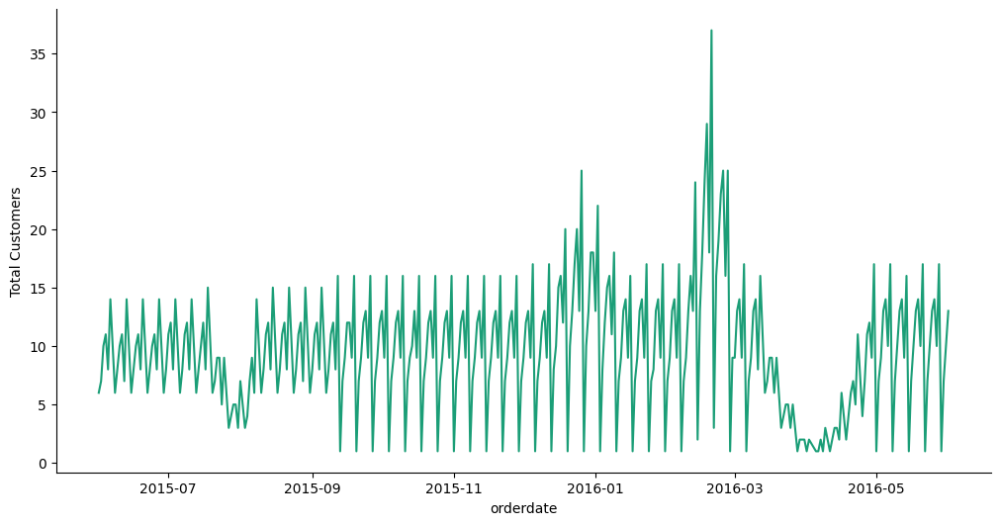
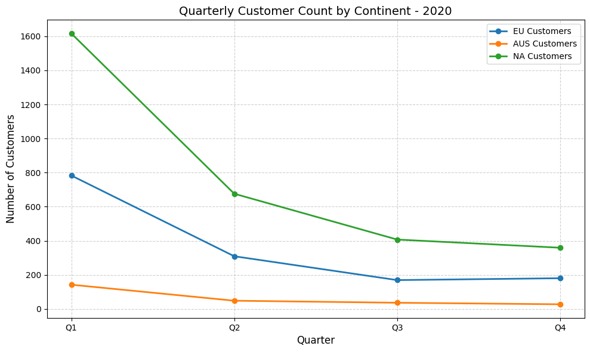
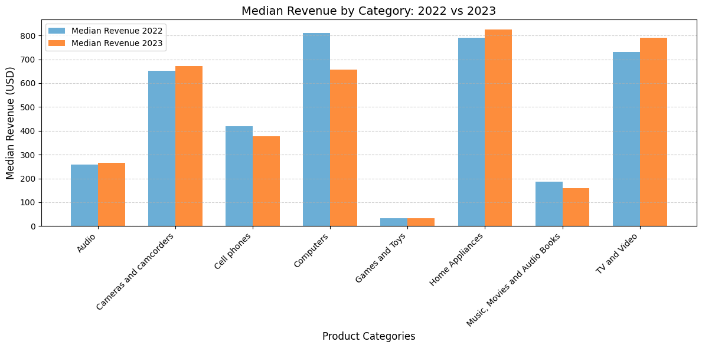

# THIS IS A *PRACTICE QUERY AND OUTPUT STACK*


```sql
%%sql

select
	-- s.productkey,
	s.orderdate,
	round((s.netprice * s.quantity * s.exchangerate)::numeric, 2) as net_revenue,
	case
		when round((s.netprice * s.quantity * s.exchangerate)::numeric, 2) < 500 then 'Low Revenue'
		when round((s.netprice * s.quantity * s.exchangerate)::numeric, 2) between 500 and 1500 then 'Medium Revenue'
		when round((s.netprice * s.quantity * s.exchangerate)::numeric, 2) > 500 then 'High Revenue'
	end as "revenue category",
	c.givenname,
	c.surname,
	c.countryfull,
	c.continent,
	p.productname,
	p.manufacturer,
	p.categoryname
from 
	sales s
left join
	customer c on s.customerkey = c.customerkey
left join
	product p on s.productkey = p.productkey
where 
	extract(year from orderdate) >= 2020
limit
	3
```
|index|orderdate|net\_revenue|revenue category|givenname|surname|countryfull|continent|productname|manufacturer|categoryname|
|---|---|---|---|---|---|---|---|---|---|---|
|0|2020-01-01|"99\.47"|Low Revenue|Heike|Burger|Germany|Europe|MGS Bicycle Card Games2009 E166|Tailspin Toys|Games and Toys|
|1|2020-01-01|"139\.97"|Low Revenue|Heike|Burger|Germany|Europe|MGS Bicycle Board Games2009 E165|Tailspin Toys|Games and Toys|
|2|2020-01-01|"669\.39"|Medium Revenue|Heike|Burger|Germany|Europe|Proseware Wireless Photo All-in-One Printer M390 Grey|Proseware, Inc\.|Computers|

---
---

```sql
select 
	orderdate,
	count(distinct customerkey) as "Total Customers"
from
	sales
where 
	orderdate between '2015-06-01' and '2016-06-01'
group by
	orderdate
order by
	orderdate
limit
  3
```
|index|orderdate|Total Customers|
|---|---|---|
|0|2015-06-01|6|
|1|2015-06-02|7|
|2|2015-06-03|10|



---
---

```sql
select 
	extract(quarter from s.orderdate) as "Quarter 2020",
	count(distinct case when c.continent = 'Europe' then s.customerkey end) as "EU Customers",
	count(distinct case when c.continent = 'Australia' then s.customerkey end) as "AUS Customers",
	count(distinct case when c.continent = 'North America' then s.customerkey end) as "NA Customers"
from
	sales s
left join
	customer c on s.customerkey = c.customerkey
where 
	extract(year from s.orderdate) = 2020
group by
	extract(quarter from s.orderdate)

```
|index|Quarter 2020|EU Customers|AUS Customers|NA Customers|
|---|---|---|---|---|
|0|"1"|783|142|1617|
|1|"2"|309|48|676|
|2|"3"|169|36|407|
|3|"4"|180|27|359|



---
---

```sql
WITH category_net AS(
    SELECT
        p.categoryname,
        round((s.quantity * s.netprice * s.exchangerate)::numeric,2) as "net revenue",
        s.orderdate,
        EXTRACT(YEAR from s.orderdate)::numeric as year
    FROM
        sales s
    LEFT JOIN
        product p ON s.productkey = p.productkey
    WHERE
        EXTRACT(YEAR from s.orderdate)::numeric = 2022 or
        EXTRACT(YEAR from s.orderdate)::numeric = 2023
)

SELECT
    categoryname,
    sum(case when year = 2022 then "net revenue" end) as "revenue 2022",
    sum(case when year = 2023 then "net revenue" end) as "revenue 2023"
FROM
    category_net
GROUP BY
    categoryname
```
|index|categoryname|revenue 2022|revenue 2023|
|---|---|---|---|
|0|Audio|"766938\.35"|"688690\.09"|
|1|Cameras and camcorders |"2382532\.52"|"1983546\.31"|
|2|Cell phones|"8119664\.96"|"6002147\.18"|
|3|Computers|"17862216\.00"|"11650867\.11"|
|4|Games and Toys|"316127\.27"|"270374\.62"|
|5|Home Appliances|"6612446\.19"|"5919992\.56"|
|6|Music, Movies and Audio Books|"2989296\.87"|"2180766\.81"|
|7|TV and Video|"5815336\.57"|"4412178\.12"|


---
---

```sql
WITH category_net AS(
    SELECT
        p.categoryname,
        round((s.quantity * s.netprice * s.exchangerate)::numeric,2) as "net revenue",
        s.orderdate,
        EXTRACT(YEAR from s.orderdate)::numeric as year
    FROM
        sales s
    LEFT JOIN
        product p ON s.productkey = p.productkey
    WHERE
        EXTRACT(YEAR from s.orderdate)::numeric = 2022 or
        EXTRACT(YEAR from s.orderdate)::numeric = 2023
)

SELECT
    categoryname,
    round(percentile_cont(0.5) within GROUP (ORDER BY(case when year = 2022 then "net revenue" end))::numeric,2) as "median revenue 2022",
    round(percentile_cont(0.5) within GROUP (ORDER BY(case when year = 2023 then "net revenue" end))::numeric,2) as "median revenue 2023"
FROM
    category_net
GROUP BY
    categoryname

```
|index|categoryname|median revenue 2022|median revenue 2023|
|---|---|---|---|
|0|Audio|"257\.21"|"266\.59"|
|1|Cameras and camcorders |"651\.46"|"672\.60"|
|2|Cell phones|"418\.60"|"375\.88"|
|3|Computers|"809\.70"|"657\.18"|
|4|Games and Toys|"33\.78"|"32\.62"|
|5|Home Appliances|"791\.00"|"825\.25"|
|6|Music, Movies and Audio Books|"186\.58"|"159\.64"|
|7|TV and Video|"730\.46"|"790\.79"|

 *median salary as per category FY2022 & 2023*
 *total salary as per category FY2022 & 2023*

---
---

#### "Multiple High Value Items" if quantity >= 2 and netprice >= 100
#### "Single High Value Item" if netprice >= 100
#### "Multiple Standard Items" if quantity >= 2
#### "Single Standard Item" otherwise

```sql
select 
  orderdate,
  quantity,
  netprice,
  case 
    when quantity >= 2 and netprice >= 100 then 'Multiple High Value Items'
    when netprice >= 100 then 'Single High Value Item'
    when quantity >= 2 then 'Multiple Standard Items'
    else 'Single Standard Item'
  end as "order type"
from
  sales
limit 3
```

|index|orderdate|quantity|netprice|order type|
|---|---|---|---|---|
|0|2015-01-01|1|98\.967|Single Standard Item|
|1|2015-01-01|1|659\.78|Single High Value Item|
|2|2015-01-01|2|54\.376|Multiple Standard Items|

---
---

