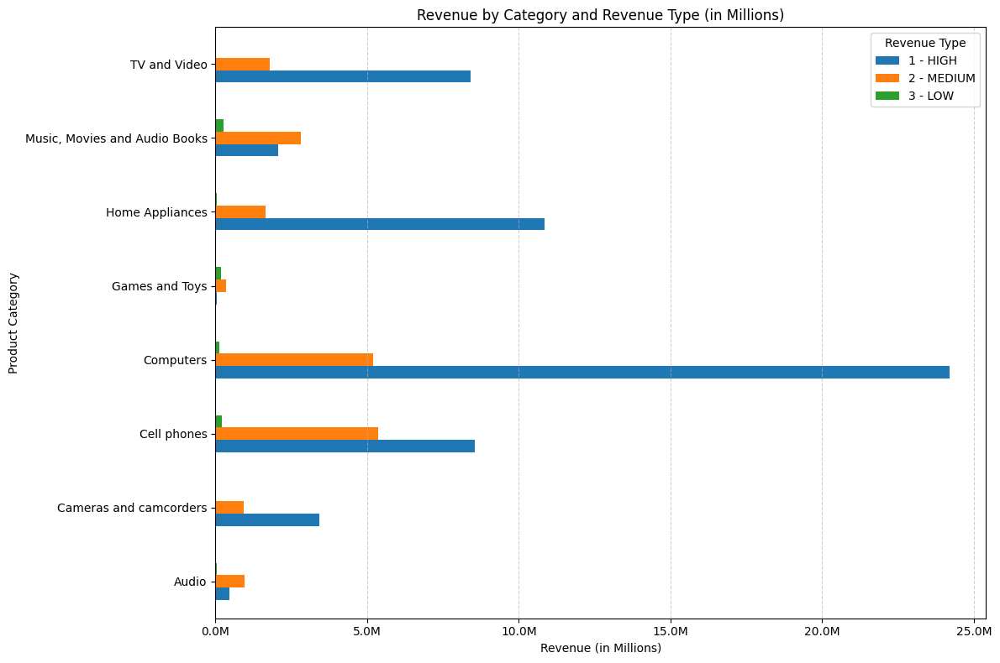
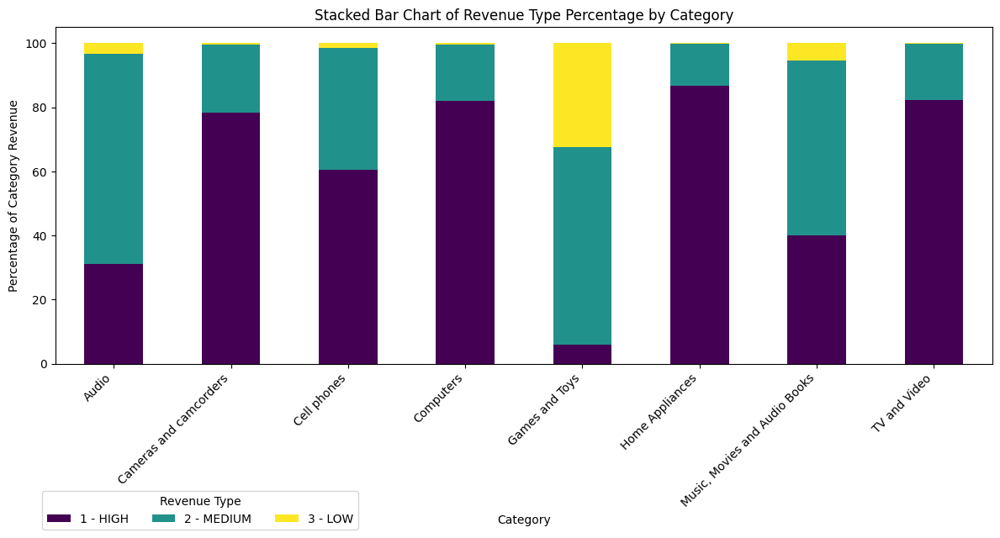

# THIS IS A *PRACTICE QUERY AND OUTPUT STACK*


```sql
%%sql

select
	-- s.productkey,
	s.orderdate,
	round((s.netprice * s.quantity * s.exchangerate)::numeric, 2) as net_revenue,
	case
		when round((s.netprice * s.quantity * s.exchangerate)::numeric, 2) < 500 then 'Low Revenue'
		when round((s.netprice * s.quantity * s.exchangerate)::numeric, 2) between 500 and 1500 then 'Medium Revenue'
		when round((s.netprice * s.quantity * s.exchangerate)::numeric, 2) > 500 then 'High Revenue'
	end as "revenue category",
	c.givenname,
	c.surname,
	c.countryfull,
	c.continent,
	p.productname,
	p.manufacturer,
	p.categoryname
from 
	sales s
left join
	customer c on s.customerkey = c.customerkey
left join
	product p on s.productkey = p.productkey
where 
	extract(year from orderdate) >= 2020
limit
	3
```
|index|orderdate|net\_revenue|revenue category|givenname|surname|countryfull|continent|productname|manufacturer|categoryname|
|---|---|---|---|---|---|---|---|---|---|---|
|0|2020-01-01|"99\.47"|Low Revenue|Heike|Burger|Germany|Europe|MGS Bicycle Card Games2009 E166|Tailspin Toys|Games and Toys|
|1|2020-01-01|"139\.97"|Low Revenue|Heike|Burger|Germany|Europe|MGS Bicycle Board Games2009 E165|Tailspin Toys|Games and Toys|
|2|2020-01-01|"669\.39"|Medium Revenue|Heike|Burger|Germany|Europe|Proseware Wireless Photo All-in-One Printer M390 Grey|Proseware, Inc\.|Computers|

---
---

```sql
select 
	orderdate,
	count(distinct customerkey) as "Total Customers"
from
	sales
where 
	orderdate between '2015-06-01' and '2016-06-01'
group by
	orderdate
order by
	orderdate
limit
  3
```
|index|orderdate|Total Customers|
|---|---|---|
|0|2015-06-01|6|
|1|2015-06-02|7|
|2|2015-06-03|10|


---
---

```sql
select 
	extract(quarter from s.orderdate) as "Quarter 2020",
	count(distinct case when c.continent = 'Europe' then s.customerkey end) as "EU Customers",
	count(distinct case when c.continent = 'Australia' then s.customerkey end) as "AUS Customers",
	count(distinct case when c.continent = 'North America' then s.customerkey end) as "NA Customers"
from
	sales s
left join
	customer c on s.customerkey = c.customerkey
where 
	extract(year from s.orderdate) = 2020
group by
	extract(quarter from s.orderdate)

```
|index|Quarter 2020|EU Customers|AUS Customers|NA Customers|
|---|---|---|---|---|
|0|"1"|783|142|1617|
|1|"2"|309|48|676|
|2|"3"|169|36|407|
|3|"4"|180|27|359|


---
---

```sql
WITH category_net AS(
    SELECT
        p.categoryname,
        round((s.quantity * s.netprice * s.exchangerate)::numeric,2) as "net revenue",
        s.orderdate,
        EXTRACT(YEAR from s.orderdate)::numeric as year
    FROM
        sales s
    LEFT JOIN
        product p ON s.productkey = p.productkey
    WHERE
        EXTRACT(YEAR from s.orderdate)::numeric = 2022 or
        EXTRACT(YEAR from s.orderdate)::numeric = 2023
)

SELECT
    categoryname,
    sum(case when year = 2022 then "net revenue" end) as "revenue 2022",
    sum(case when year = 2023 then "net revenue" end) as "revenue 2023"
FROM
    category_net
GROUP BY
    categoryname
```
|index|categoryname|revenue 2022|revenue 2023|
|---|---|---|---|
|0|Audio|"766938\.35"|"688690\.09"|
|1|Cameras and camcorders |"2382532\.52"|"1983546\.31"|
|2|Cell phones|"8119664\.96"|"6002147\.18"|
|3|Computers|"17862216\.00"|"11650867\.11"|
|4|Games and Toys|"316127\.27"|"270374\.62"|
|5|Home Appliances|"6612446\.19"|"5919992\.56"|
|6|Music, Movies and Audio Books|"2989296\.87"|"2180766\.81"|
|7|TV and Video|"5815336\.57"|"4412178\.12"|


---
---

```sql
WITH category_net AS(
    SELECT
        p.categoryname,
        round((s.quantity * s.netprice * s.exchangerate)::numeric,2) as "net revenue",
        s.orderdate,
        EXTRACT(YEAR from s.orderdate)::numeric as year
    FROM
        sales s
    LEFT JOIN
        product p ON s.productkey = p.productkey
    WHERE
        EXTRACT(YEAR from s.orderdate)::numeric = 2022 or
        EXTRACT(YEAR from s.orderdate)::numeric = 2023
)

SELECT
    categoryname,
    round(percentile_cont(0.5) within GROUP (ORDER BY(case when year = 2022 then "net revenue" end))::numeric,2) as "median revenue 2022",
    round(percentile_cont(0.5) within GROUP (ORDER BY(case when year = 2023 then "net revenue" end))::numeric,2) as "median revenue 2023"
FROM
    category_net
GROUP BY
    categoryname

```
```sql
WITH category_net AS(
    SELECT
        p.categoryname,
        round((s.quantity * s.netprice * s.exchangerate)::numeric,2) as "net revenue",
        s.orderdate,
        EXTRACT(YEAR from s.orderdate)::numeric as year
    FROM
        sales s
    LEFT JOIN
        product p ON s.productkey = p.productkey
    WHERE
        EXTRACT(YEAR from s.orderdate)::numeric between 2022 and 2023
)

SELECT
    categoryname,
    round(percentile_cont(0.5) within GROUP (ORDER BY(case when year = 2022 then "net revenue" end))::numeric,2) as "median revenue 2022",
    round(percentile_cont(0.5) within GROUP (ORDER BY(case when year = 2023 then "net revenue" end))::numeric,2) as "median revenue 2023"
FROM
    category_net
GROUP BY
    categoryname


```
|index|categoryname|median revenue 2022|median revenue 2023|
|---|---|---|---|
|0|Audio|"257\.21"|"266\.59"|
|1|Cameras and camcorders |"651\.46"|"672\.60"|
|2|Cell phones|"418\.60"|"375\.88"|
|3|Computers|"809\.70"|"657\.18"|
|4|Games and Toys|"33\.78"|"32\.62"|
|5|Home Appliances|"791\.00"|"825\.25"|
|6|Music, Movies and Audio Books|"186\.58"|"159\.64"|
|7|TV and Video|"730\.46"|"790\.79"|

 *median salary as per category FY2022 & 2023*
 *total salary as per category FY2022 & 2023*

---
---

#### "Multiple High Value Items" if quantity >= 2 and netprice >= 100
#### "Single High Value Item" if netprice >= 100
#### "Multiple Standard Items" if quantity >= 2
#### "Single Standard Item" otherwise

```sql
select 
  orderdate,
  quantity,
  netprice,
  case 
    when quantity >= 2 and netprice >= 100 then 'Multiple High Value Items'
    when netprice >= 100 then 'Single High Value Item'
    when quantity >= 2 then 'Multiple Standard Items'
    else 'Single Standard Item'
  end as "order type"
from
  sales
limit 3
```

|index|orderdate|quantity|netprice|order type|
|---|---|---|---|---|
|0|2015-01-01|1|98\.967|Single Standard Item|
|1|2015-01-01|1|659\.78|Single High Value Item|
|2|2015-01-01|2|54\.376|Multiple Standard Items|

---
---
#### 
```sql
SELECT      
    percentile_cont(0.5) within group (order by(round((s.quantity * s.netprice * s.exchangerate)::numeric,2))) as "median net revenue"
from 
    sales s
WHERE
    EXTRACT(YEAR from s.orderdate)::numeric between 2022 and 2023;
```
*median of the whole data*
```sql
WITH category_net AS(
    SELECT
        p.categoryname,
        round((s.quantity * s.netprice * s.exchangerate)::numeric,2) as "net revenue",
        s.orderdate,
        EXTRACT(YEAR from s.orderdate)::numeric as year
    FROM
        sales s
    LEFT JOIN
        product p ON s.productkey = p.productkey
    WHERE
        EXTRACT(YEAR from s.orderdate)::numeric between 2022 and 2023
)

SELECT
    categoryname,
    sum(case when "net revenue" < 398 and year = 2022 then "net revenue"  end) as "low revenue 2022",
    sum(case when "net revenue" >= 398 and year = 2022 then "net revenue" end) as "high revenue 2022",
    sum(case when "net revenue" < 398 and year = 2023 then "net revenue"  end) as "low revenue 2023",
    sum(case when "net revenue" >= 398 and year = 2023 then "net revenue" end) as "high revenue 2023"
FROM
    category_net
GROUP BY
    categoryname
```
---
*same as above, but median is now combined in single query*
```sql
WITH category_net AS(
    SELECT
        p.categoryname,
        round((s.quantity * s.netprice * s.exchangerate)::numeric,2) as "net revenue",
        s.orderdate,
        EXTRACT(YEAR from s.orderdate)::numeric as year
    FROM
        sales s
    LEFT JOIN
        product p ON s.productkey = p.productkey
    WHERE
        EXTRACT(YEAR from s.orderdate)::numeric between 2022 and 2023
), median_value AS(
    SELECT      
        percentile_cont(0.5) within group (order by(round((s.quantity * s.netprice * s.exchangerate)::numeric,2))) as "median net revenue"
    from 
        sales s
    WHERE
        EXTRACT(YEAR from s.orderdate)::numeric between 2022 and 2023
)

SELECT
    categoryname,
    sum(case when "net revenue" < "median net revenue" and year = 2022 then "net revenue"  end) as "low revenue 2022",
    sum(case when "net revenue" >= "median net revenue" and year = 2022 then "net revenue" end) as "high revenue 2022",
    sum(case when "net revenue" < "median net revenue" and year = 2023 then "net revenue"  end) as "low revenue 2023",
    sum(case when "net revenue" >= "median net revenue" and year = 2023 then "net revenue" end) as "high revenue 2023"
FROM
    category_net,
    median_value
GROUP BY
    categoryname
```
|index|categoryname|low revenue 2022|high revenue 2022|low revenue 2023|high revenue 2023|
|---|---|---|---|---|---|
|0|Audio|"222337\.78"|"544600\.57"|"180251\.02"|"508439\.07"|
|1|Cameras and camcorders |"133004\.54"|"2249527\.98"|"104869\.45"|"1878676\.86"|
|2|Cell phones|"814449\.40"|"7305215\.56"|"729698\.95"|"5272448\.23"|
|3|Computers|"624341\.26"|"17237874\.74"|"590790\.32"|"11060076\.79"|
|4|Games and Toys|"231979\.57"|"84147\.70"|"206103\.07"|"64271\.55"|
|5|Home Appliances|"219796\.55"|"6392649\.64"|"176260\.98"|"5743731\.58"|
|6|Music, Movies and Audio Books|"685808\.21"|"2303488\.66"|"574957\.74"|"1605809\.07"|
|7|TV and Video|"272338\.39"|"5542998\.18"|"164275\.28"|"4247902\.84"|


---
---

```sql
WITH category_net AS(
    SELECT
        p.categoryname,
        round((s.quantity * s.netprice * s.exchangerate)::numeric,2) as "net revenue",
        s.orderdate,
        EXTRACT(YEAR from s.orderdate)::numeric as year
    FROM
        sales s
    LEFT JOIN
        product p ON s.productkey = p.productkey
    WHERE
        s.orderdate between '2022-01-01' and '2023-12-31'
),
percentile_value AS(
    SELECT      
        percentile_cont(0.25) within group (order by(round((s.quantity * s.netprice * s.exchangerate)::numeric,2))) as revenue25th,
        percentile_cont(0.75) within group (order by(round((s.quantity * s.netprice * s.exchangerate)::numeric,2))) as revenue75th
    from 
        sales s
    WHERE
        EXTRACT(YEAR from s.orderdate)::numeric between 2022 and 2023
)
SELECT
    c.categoryname,
    case
        when c."net revenue" <= p.revenue25th then '3 - LOW'
        when c."net revenue" >= p.revenue75th then '1 - HIGH'
        else '2 - MEDIUM'
    end as "revenue type",
    sum(c."net revenue")
FROM
    category_net c,
    percentile_value p
GROUP BY
    c.categoryname,
    "revenue type"
order BY
    c.categoryname,
    "revenue type"
```
|index|categoryname|revenue type|sum|
|---|---|---|---|
|0|Audio|1 - HIGH|"453108\.94"|
|1|Audio|2 - MEDIUM|"952700\.04"|
|2|Audio|3 - LOW|"49819\.46"|
|3|Cameras and camcorders |1 - HIGH|"3414876\.59"|
|4|Cameras and camcorders |2 - MEDIUM|"929414\.24"|
|5|Cameras and camcorders |3 - LOW|"21788\.00"|
|6|Cell phones|1 - HIGH|"8557888\.96"|
|7|Cell phones|2 - MEDIUM|"5357700\.10"|
|8|Cell phones|3 - LOW|"206223\.08"|
|9|Computers|1 - HIGH|"24192946\.44"|
|10|Computers|2 - MEDIUM|"5205799\.93"|
|11|Computers|3 - LOW|"114336\.74"|
|12|Games and Toys|1 - HIGH|"34626\.00"|
|13|Games and Toys|2 - MEDIUM|"361328\.49"|
|14|Games and Toys|3 - LOW|"190547\.40"|
|15|Home Appliances|1 - HIGH|"10851234\.76"|
|16|Home Appliances|2 - MEDIUM|"1646681\.91"|
|17|Home Appliances|3 - LOW|"34522\.08"|
|18|Music, Movies and Audio Books|1 - HIGH|"2074182\.77"|
|19|Music, Movies and Audio Books|2 - MEDIUM|"2817358\.32"|
|20|Music, Movies and Audio Books|3 - LOW|"278522\.59"|
|21|TV and Video|1 - HIGH|"8406606\.87"|
|22|TV and Video|2 - MEDIUM|"1796291\.28"|
|23|TV and Video|3 - LOW|"24616\.54"|

```sql
WITH category_net AS(
    SELECT
        p.categoryname,
        round((s.quantity * s.netprice * s.exchangerate)::numeric,2) as "net revenue",
        s.orderdate,
        EXTRACT(YEAR from s.orderdate)::numeric as year
    FROM
        sales s
    LEFT JOIN
        product p ON s.productkey = p.productkey
    WHERE
        s.orderdate between '2022-01-01' and '2023-12-31'
),
percentile_value AS(
    SELECT      
        percentile_cont(0.25) within group (order by(round((s.quantity * s.netprice * s.exchangerate)::numeric,2))) as revenue25th,
        percentile_cont(0.75) within group (order by(round((s.quantity * s.netprice * s.exchangerate)::numeric,2))) as revenue75th
    from 
        sales s
    WHERE
        EXTRACT(YEAR from s.orderdate)::numeric between 2022 and 2023
),
categorized as(
    SELECT
        c.categoryname,
        case
            when c."net revenue" <= p.revenue25th then '3 - LOW'
            when c."net revenue" >= p.revenue75th then '1 - HIGH'
            else '2 - MEDIUM'
        end as "revenue type",
        sum(c."net revenue") "total revenue"
    FROM
        category_net c,
        percentile_value p
    GROUP BY
        c.categoryname,
        "revenue type"
    order BY
        c.categoryname,
        "revenue type"
)
SELECT
    categoryname,
    "revenue type",
    "total revenue",
    ROUND("total revenue" / SUM("total revenue") OVER (PARTITION BY categoryname) * 100, 2) AS "percent of category"
FROM
    categorized
GROUP BY
    categoryname,
    "total revenue",
    "revenue type"
ORDER BY
    categoryname,
    "revenue type"
```
|index|categoryname|revenue type|total revenue|percent of category|
|---|---|---|---|---|
|0|Audio|1 - HIGH|"453108\.94"|"31\.13"|
|1|Audio|2 - MEDIUM|"952700\.04"|"65\.45"|
|2|Audio|3 - LOW|"49819\.46"|"3\.42"|
|3|Cameras and camcorders |1 - HIGH|"3414876\.59"|"78\.21"|
|4|Cameras and camcorders |2 - MEDIUM|"929414\.24"|"21\.29"|
|5|Cameras and camcorders |3 - LOW|"21788\.00"|"0\.50"|
|6|Cell phones|1 - HIGH|"8557888\.96"|"60\.60"|
|7|Cell phones|2 - MEDIUM|"5357700\.10"|"37\.94"|
|8|Cell phones|3 - LOW|"206223\.08"|"1\.46"|
|9|Computers|1 - HIGH|"24192946\.44"|"81\.97"|
|10|Computers|2 - MEDIUM|"5205799\.93"|"17\.64"|
|11|Computers|3 - LOW|"114336\.74"|"0\.39"|
|12|Games and Toys|1 - HIGH|"34626\.00"|"5\.90"|
|13|Games and Toys|2 - MEDIUM|"361328\.49"|"61\.61"|
|14|Games and Toys|3 - LOW|"190547\.40"|"32\.49"|
|15|Home Appliances|1 - HIGH|"10851234\.76"|"86\.59"|
|16|Home Appliances|2 - MEDIUM|"1646681\.91"|"13\.14"|
|17|Home Appliances|3 - LOW|"34522\.08"|"0\.28"|
|18|Music, Movies and Audio Books|1 - HIGH|"2074182\.77"|"40\.12"|
|19|Music, Movies and Audio Books|2 - MEDIUM|"2817358\.32"|"54\.49"|
|20|Music, Movies and Audio Books|3 - LOW|"278522\.59"|"5\.39"|
|21|TV and Video|1 - HIGH|"8406606\.87"|"82\.20"|
|22|TV and Video|2 - MEDIUM|"1796291\.28"|"17\.56"|
|23|TV and Video|3 - LOW|"24616\.54"|"0\.24"|



